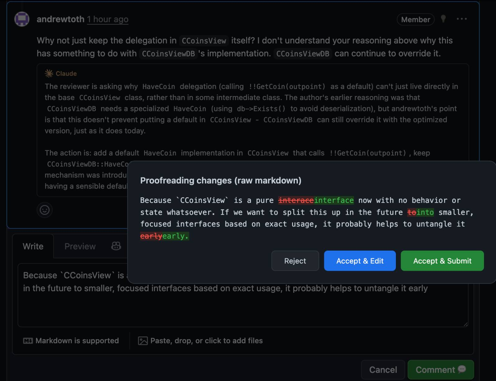
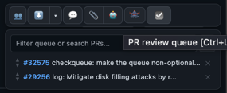
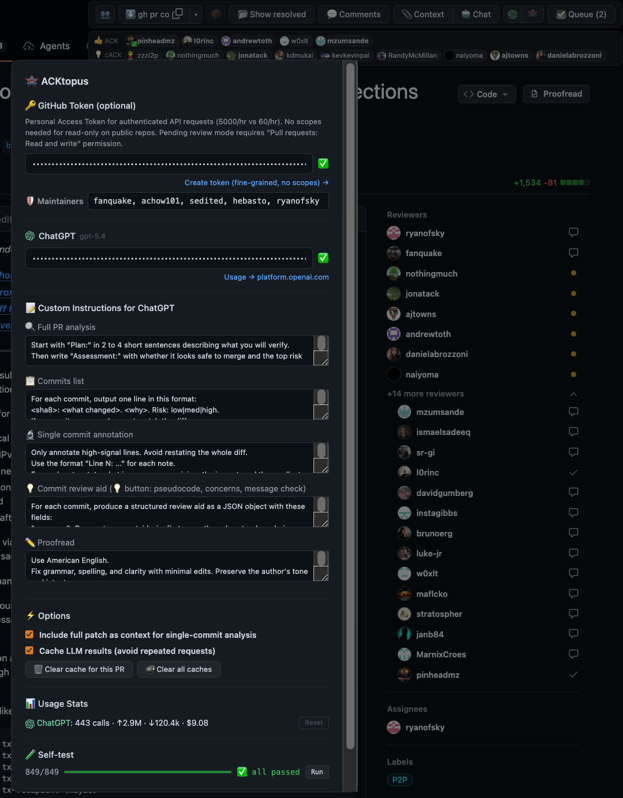

<h1> ACKtopus</h1>

ACKtopus is a GitHub userscript for [Tampermonkey](https://www.tampermonkey.net/) that adds a floating review toolbar, context-copy tools, LLM review recipes, proofreading, pending-review helpers, and queue/navigation shortcuts on GitHub pull requests and issues (optimized for Bitcoin Core-style review).

## Highlights

_Floating toolbar with ACK/NACK parsing and jumpable review signals._

----

_Selection helper with quick explain/fact-check/simplify/proofread actions._

----

_PR lightbulb overview with high-level context and reviewer-oriented guidance._

----

_Clipboard-ready PR, commit, and comment context for sharing or LLM use._

----

_Pending-review helpers directly from Conversation replies and the main comment box._

----

_Pending-comment feedback that simulates the likely author response before you post._

----

_Per-PR clipboard helpers for ACKs, checkout, range-diff, and review commands._

----

_Single-commit lightbulb with summary, why-it-matters, pseudocode, and concerns._

----

_Commits-page lightbulbs showing how each commit fits into the stacked PR._

----

_Comment explanation in context for understanding review remarks quickly._

----

_LLM chat panel with page context and navigation-aware review assistance._

----

_Proofread flow with diff-style review before applying text changes._

----

_Automatic commit prefix on single-commit views so inline comments stay revision-specific._

----

_Compare-page cleanup that collapses unrelated files and keeps focus on the PR-relevant diff._

----

_Bulk expansion of hidden, minimized, outdated, or otherwise collapsed review content._

----

_Chronological comment navigation for quickly walking long review discussions._

----

_Personal review queue for pull requests you want to revisit later._

----

_Settings for tokens, providers, maintainer list, caches, and compact toolbar behavior._

## What it helps with

- Tracking ACK/Concept ACK/NACK signals and jumping back to the source comments
- Copying ACKs, checkout commands, range-diffs, local pre-push range-diffs, and focused test/format commands
- Copying PR, issue, commit, patch, comment, and visible discussion context to the clipboard
- Revealing hidden conversations, resolved threads, minimized comments, outdated sections, and deferred diffs in bulk
- Navigating long PRs by comment, file, and commit
- Reviewing with LLM chat, local reproducer prompts, maintainer summaries, commit lightbulbs, selection helpers, and cached PR/commit infographics
- Proofreading comments, PR descriptions, selected prose, and draft PR text with a diff preview before applying changes
- Starting/submitting pending GitHub reviews from the Conversation tab
- Keeping a personal PR review queue

## Toolbar (top-right)

### 👥 ACK panel

Shows detected ACKs/Concept ACKs/Approach ACKs/NACKs/Stale ACKs and lets you jump to the comment that contained them. Repository members are highlighted, configured maintainers get stronger highlighting, and PGP-signed ACK details can show verification badges when a key is available.

### SHA / ACK copy

Copies useful snippets based on the PR head commit, such as:

- `ACK <sha>`
- `git fetch ... && git switch --detach FETCH_HEAD`
- checkout-parent and `gh pr co ... && git pull --rebase "$REMOTE" <base>` helpers, with `upstream`/`origin` remote fallback
- `git range-diff` from your last ACK or the latest force-push
- rebase-both-sides-and-diff commands for cleaner force-push comparisons
- pre-push `git range-diff "$BASE..@{u}" "$BASE..HEAD"` for comparing the pushed tracking branch with local `HEAD`
- benchmark, unit-test, fuzz, and functional-test commands when changed files make those targets discoverable

These buttons always **copy to your clipboard** (they never insert text into a comment box).

Tip: hold **Ctrl** for ~0.5s to show the hotkey chooser. Press the letter to copy that format, or press **Enter** to copy the currently selected format (the one shown on the main SHA button).

If the PR changes C/C++ files, additional per-PR helpers appear:

- `clang-format-diff`: apply formatting only to changed lines
- `clang-tidy-diff`: run clang-tidy only on changed lines
- `IWYU (changed)`: run include-what-you-use only on changed `src/*.h` / `src/*.cpp` files

These three commands are generated with the PR’s exact changed C/C++ file paths already filled in, so they are ready to run as-is.

### 📦 / 📂 / 🪟 Expand dropdown

The expand control can run three related actions:

- **Show hidden**: loads hidden conversation/comment pagination
- **Show resolved**: expands resolved review threads
- **Open collapsed**: opens minimized comments, outdated sections, and “Load diff” buttons for large diffs

The context-copy dropdown also has **Reveal all**, which walks through hidden conversations, resolved threads, collapsed sections, and deferred diffs before copying.

### 💬 Comment navigation

Jumps between comments by date on PR pages, and between visible files on compare pages. Hold **Shift** to reverse direction. The delayed Ctrl hotkey chooser exposes this as **Ctrl+N** after the chooser is armed.

### 📎 Context copy

Copies page context to your clipboard for sharing or pasting into an LLM. The dropdown supports:

- **Patch**: PR description, commits, and patch
- **Comments**: description plus visible comments, without the patch
- **Full**: URL, title, description, commits, patch, and visible comments
- **Reveal all**: expands hidden/resolved/collapsed content before copying

On single-commit pages like `/changes/<sha>` and `/commits/<sha>`, the same button copies **commit-only** context instead: the parent PR metadata/description, the current commit patch, and visible comments tied to that commit.
Each comment’s `...` menu also gets a **Copy comment context** action, which copies just that comment plus its surrounding thread and location metadata (file, line, commit, author, permalink).

### 🤖 Robot recipes / Chat

Opens a robot panel backed by the active Claude or ChatGPT provider. The dropdown supports:

- **Chat**: ask about the page, use `/find ...` to navigate visible comments/code, or use `/quiz` for high-leverage review questions
- **Reproducer**: generate one outcome-focused local-agent prompt for no-peek reimplementation, PR commit splitting, suggestion commits, and a verbose audio-guide walkthrough
- **Maintainer view**: summarize mergeability, unresolved threads, reviewer positions, and suggested maintainer focus
- **Infographic**: generate a cached OpenAI PR or current-commit infographic for a high-level visual overview

Chat answers can cite visible comments/code with clickable `[ref:N]` links. For explain/proofread/fact-check flows, ACKtopus includes PR-level context (description, commit messages, diff) with larger context windows to improve response quality. Reproducer prompts also show the exact generated system/user prompt in a collapsible section so it can be inspected or reused directly. The generated prompt frames each phase by the artifact and acceptance criteria that should exist when the phase is done. It keeps the first local-agent phase abstract and forbids peeking at the submitted PR implementation until approval; later phases split the real PR into reviewable commits, rebase local rediscovery work on top as evidence-backed suggestion commits, and produce a GitHub-link-rich audio guide.

The infographic flow first asks OpenAI to distill the source into a sparse visual prompt, then calls OpenAI image generation (`gpt-image-2`) for a landscape technical infographic. On normal PR pages it summarizes the full PR; on `/changes/<sha>` and `/commits/<sha>` it focuses on the current commit, using PR context only to explain why that commit matters. The image prompt carries the source PR URL and current page URL for reference, asks for the single overall concept the image should communicate, and prioritizes the most complicated, important, risky, or hard-to-explain parts so the output compresses the review target rather than listing details. Results are cached per PR head or commit SHA/model/image settings/prompt version and can be reopened, downloaded, or inspected by copying the generated image prompt. The exact image prompt is always shown in a collapsible section when available, including the organization-verification fallback path so it can be pasted into `gpt-image-2` manually.

The **main PR description lightbulb** is treated specially: after generating the high-level overview, it also precomputes commit lightbulb caches (commits view + single-commit view) using richer PR context (including discussion/replies), so those views can open their lightbulb panels immediately from cache.

### ☑️ Queue

Keeps a personal list of PRs you want to come back to. You can add the current PR, search GitHub by PR number or text, open queued PRs in a new tab, reorder entries, remove entries, and see the queue count on the toolbar. The delayed Ctrl hotkey chooser exposes this as **Ctrl+L**.

### Settings

Lets you configure the optional GitHub PAT, Claude/OpenAI API keys, active provider, maintainer logins, custom instructions for each recipe, full-patch context, LLM caching, cache clearing, and factory reset. The toolbar background toggles compact mode. Shift-clicking the settings logo clears caches. Selection popups use the same active provider/model as the rest of ACKtopus (no separate selection-helper settings).

## In-page review helpers

### Commit prefix on single-commit views

On single-commit pages like `/changes/<sha>` and `/commits/<sha>`, when you open a new inline comment box (new thread), ACKtopus pre-fills it with a commit link prefix. This makes it obvious which revision the comment refers to (especially helpful after rebases/force-pushes).

### Commit navigation and lightbulbs

On PR conversation, commits-list, single-commit, and changes views, ACKtopus adds floating commit navigation that shows commit messages and position and supports the delayed **Ctrl+J/K** shortcuts. For larger commit stacks, clicking the middle commit chooser opens a searchable commit list; typing filters by SHA, position, or message, **Up/Down** changes the selected row, **Enter** opens it, and **Esc** or outside click closes it. Commit lightbulbs generate structured review aids with summary, context, why-it-matters, high-level pseudocode, verification notes, performance/simplification notes, concerns, message checks, and dependency notes.

### Explain / Chat / Fact check on selections

When you select text on a PR page (diff lines, commit messages, or comments), ACKtopus shows a small popup with a short (1-2 line) context summary and:

- **Explain**: quick explanation of the selected snippet in the context of the commit
- **Fact check**: checks whether the selected claim is accurate using the full PR context
- **Simplify**: proposes a simpler version (for code: fewer moving parts / less duplication; for text: simpler language)
- **Proofread**: useful when the selection is prose (docs/comments); it won’t try to rewrite code, uses the same diff accept/reject flow as regular proofreading, and may apply small structural markdown upgrades when clearly appropriate (alerts, better `
` labels, obvious fence languages)
- **Chat**: docked on the right of the popup output area; opens the Chat panel with the selection quoted and file/line/commit context included, plus any popup output already shown

For short replies like “sure, done”, **Fact check** also includes the surrounding reply thread so the claim can be interpreted in context.

If a cached PR-level lightbulb overview exists, ACKtopus feeds that into these quick selection helpers (especially the short summary / explain / simplify paths) to improve relevance without turning them into slow, heavy requests. The helper also includes the surrounding parent text block so the selected snippet is interpreted in context instead of isolation.

The popup keeps the action buttons on a single row, prefers to open below the selection when there is room, stays viewport-clamped, and can be dismissed by clicking anywhere outside of it.
The quick 1-2 line summary is fetched automatically after a short stable-selection delay when an LLM provider is configured. If the selection is cleared or immediately copied with `Cmd+C` / `Ctrl+C`, ACKtopus suppresses the tooltip and skips the LLM call.

### Start a review (from Conversation replies)

On the PR Conversation tab, reply boxes normally only show **Comment**. ACKtopus adds a **Start a review** button next to it (only on replies), so you can start a review without navigating to the Files/Changes views.

When a pending review already exists, ACKtopus marks reply and inline comment buttons with `⏳`, and adds a **Submit review** button to the main Conversation comment box.
If the main comment box is empty, it submits the pending comments only.
If it has text, that text is used as the review summary while submitting the pending comments.

### Quick actions on comments

ACKtopus adds small action buttons on comments to speed up common tasks:

- **Explain**: summarize/explain the comment or PR body in context
- **Expected author reply**: simulate the likely author response for your own pending/review comments
- **Proofread**: improve clarity/grammar without changing meaning while preserving intentional paragraph spacing/blank lines (available while editing; it won’t auto-edit a closed comment). When clearly useful, it can also convert `Note`/`Tip`/`Important`/`Warning`/`Caution` lead-ins (with or without `:`) to GitHub alerts, upgrade generic collapsible summaries, and preserve/update code-fence languages suggested by the proofread result.
- **Edit / Delete**: shortcuts to GitHub’s native actions (in delete confirmations, **Enter deletes** and **Escape cancels**)

Inline review comments also get a quick link back to the Changes tab when ACKtopus can identify the review comment id, and pending comments get a readable “just now (pending)” timestamp. When editing an existing comment, clicking **Update comment** without changing the text is treated as **Cancel** (no server update), so the comment content stays byte-for-byte unchanged. For comment editing, ACKtopus prefers the nearby native `edit_form` fragment when it is already available, and otherwise falls back to it when GitHub’s action menu is slow or incomplete.

### PR creation proofreading

On compare-based **new PR** pages, ACKtopus adds proofreading to the draft title and body editors. If the draft body is empty, the proofread flow can generate a short two-paragraph PR description from the draft title, commit messages, and compare patch.

### Wrap selection in collapsible details

Adds a helper button near the comment editor to wrap the current selection in a collapsible details block (handy for long logs or optional context).

### Sticky edit toolbar

Keeps the comment formatting toolbar accessible while editing longer comments.

### Faster reactions

Makes reacting faster by reducing clicks (for example: hover to open the picker and quick cycling on click).

### PGP signature badges

ACKtopus scans visible comment details blocks for cleartext PGP signatures, fetches keys from `keys.openpgp.org`, verifies signatures with `openpgp.js`, caches results, and marks valid, invalid, or failed checks inline.

### Focused compare/diff views

On compare-style views, ACKtopus can collapse files that are unrelated to the PR so the diff stays focused on what you’re reviewing.
After collapsing unrelated files, it also scrolls to the first remaining open file.

## Development checks

- `pnpm run check` runs a Node syntax check over the userscript.
- `pnpm run build` runs TypeScript over the JavaScript source without emitting files.
- The in-browser self-test runner is available from ACKtopus settings on GitHub pages and covers DOM-dependent behavior against the live page.
